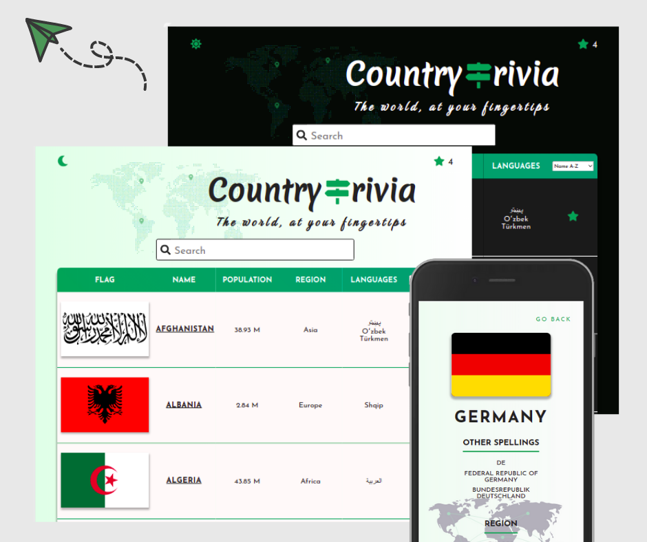

# Country Trivia, A Frontend React Project

This is my front-end project for Integrify International Academy. Country Trivia is a website that displays information about countries from around the globe using the REST Countries API.

**Click here to check it out: [link to Country Trivia](https://countrytrivia.netlify.app/)**

## Features

- Filterable, responsive table displaying all the countries in the API
  - Filter the countries by name of population
  - Displayed information changes based on window size to avoid overcrowding the table
  - Use the searchbar to quickly find a country
- Individual country pages
- Light and Dark themes
- Favorites list
  - Bookmark any of the countries in the table for future reference

## Technologies

    In the coding of this website, I used:

    * React
    * Typescript
    * Redux

## Design

The website is fully responsive and designed entirely from scratch, using _styled components_.
