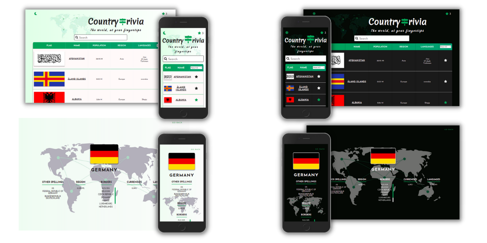

<h1 align="center">Country Trivia</h1>

## 🚀 Check Out The Website

[Link to Country Trivia](https://countrytrivia.netlify.app/)

## ✨ Features

- **Filterable, responsive table** displaying all the countries in the API
  - Filter the countries by name of population
  - Displayed information changes based on window size to avoid overcrowding the table
  - Use the searchbar to quickly find a country
- **Individual country pages**
- **Light and Dark themes**
- **Favorites list**
  - Bookmark any of the countries in the table for future reference
- **Local Storage**
  - theme choice and favorited countries remain in the local storage

## 🔧 Built With

- **React**
- **Typescript**
- **Redux**

## 🖌️ Design

The website is fully responsive and designed entirely from scratch, using _styled components_.
